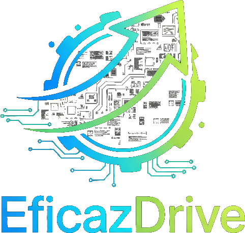

# EficazDrive

PT-BR

EficazDrive é um serviço Android em segundo plano que monitora a tela para identificar solicitações de corridas (Uber/99/Bolt/InDrive/Rappi, etc.), executa OCR on-device (ML Kit), extrai os dados por meio de regras configuráveis por plataforma, calcula métricas (tempo, distância, custos, lucro estimado, etc.) e exibe um popup em overlay com os resultados em JSON. O projeto foi desenhado para ser simples, robusto, eficiente e seguro, priorizando desempenho e baixa latência.

Principais recursos

-   Serviço foreground com captura de tela via MediaProjection
-   OCR on-device (Google ML Kit) para alto desempenho e privacidade
-   Extração por regras (regex/markers) por plataforma, definidas em `assets/config/platform_rules.json`
-   Cálculos configuráveis por expressões em `assets/config/calculations.json`
-   Popup overlay com JSON e botão de fechar; tempo de exibição configurável em `assets/config/app.json`
-   Código moderno em Kotlin com coroutines, organizado por camadas

Instalação (sem Play Store)

1. Pré-requisitos: Android SDK, adb, Java 17+ e Gradle instalados (ou use os scripts em `scripts/`).
2. Conecte um dispositivo via USB com depuração habilitada.
3. Execute:
    - `bash scripts/build.sh` (gera o APK debug)
    - `bash scripts/install.sh` (instala no dispositivo via ADB)
    - Para instalar em um serial específico: `adb -s <SERIAL> install -r app/build/outputs/apk/debug/app-debug.apk`
    - Exemplo: `adb -s 5686add7 install -r app/build/outputs/apk/debug/app-debug.apk`
    - Alternativa: enviar o APK ao armazenamento do dispositivo (USB/ADB) e instalar manualmente:
        - `adb -s 5686add7 push dist/eficazdrive-debug.apk /sdcard/Download/`
        - No aparelho, abra o arquivo em Download e confirme a instalação
4. Abra o app (permissões):
    - Conceda a permissão de sobreposição (draw over other apps)
    - Conceda permissão de captura de tela (MediaProjection) quando solicitado
    - O serviço iniciará e o popup será mostrado quando uma solicitação for detectada

Arquitetura

-   Módulos
    -   `app`: aplicação Android (Kotlin), minSdk 26, targetSdk 34, Java/Kotlin 17
-   Camadas principais (pacotes em `dev.eficazdrive.app`)
    -   `core`
        -   `CaptureOcrService`: serviço foreground que inicializa notificação, laço de captura (placeholder para MediaProjection) e OCR (ML Kit). Envia texto ao `RuleEngine`.
        -   `RuleEngine`: carrega configs de `assets/config`, identifica plataforma via markers, extrai campos com regex, avalia fórmulas simples (+ - \* /) e dispara `PopupOverlay` com JSON.
        -   `ServiceStatus`: estado thread‑safe para UI refletir se o serviço está rodando.
    -   `overlay`
        -   `PopupOverlay`: cria uma janela de sobreposição com `ViewBinding` para exibir JSON e auto‑fechar após `displayMs`.
    -   `ui`
        -   `MainActivity`: solicita permissões (notificações e overlay), inicia/para o serviço e mostra status visual.
    -   Raiz
        -   `EficazDriveApp`: classe `Application` para configurações globais.
-   Recursos e configuração
    -   Layouts: `activity_main.xml`, `popup_overlay.xml`
    -   Drawables: `circle_green.xml`, `circle_red.xml`
    -   Configs: `assets/config/app.json` (popup/display/intervalo), `platform_rules.json` (marcadores/regex), `calculations.json` (fórmulas numéricas)
-   Dependências principais
    -   AndroidX AppCompat/Material/ConstraintLayout
    -   Coroutines
    -   Google ML Kit Text Recognition (on‑device)
    -   Jackson (databind + module‑kotlin)

Permissões e requisitos

-   `SYSTEM_ALERT_WINDOW` para overlay
-   `FOREGROUND_SERVICE` e `FOREGROUND_SERVICE_MEDIA_PROJECTION` para serviço de captura
-   `POST_NOTIFICATIONS` (Android 13+)
-   Em tempo de execução, o usuário deve conceder overlay e autorização de captura de tela

Configuração

-   `app/src/main/assets/config/app.json`: tempo de exibição do popup, janela/área de captura
-   `app/src/main/assets/config/platform_rules.json`: markers e regex por plataforma para extrair campos
-   `app/src/main/assets/config/calculations.json`: fórmulas para derivar métricas (ex.: lucro estimado)

Como funciona (resumo)

1. O serviço captura periodicamente um frame da tela
2. O OCR converte a imagem em texto
3. O mecanismo de regras identifica a plataforma e extrai valores via regex
4. As fórmulas configuradas são avaliadas para gerar métricas adicionais
5. O popup overlay exibe todos os dados em JSON e fecha automaticamente

Licença MIT (ver LICENSE)

Contribuição Veja CONTRIBUTING.md

Publicação no GitHub Consulte PUBLISHING.md para instruções e boas práticas.

EN

EficazDrive is an Android foreground service that monitors the screen to detect ride requests (Uber/99/Bolt/InDrive/Rappi, etc.), performs on-device OCR (ML Kit), extracts data via per‑platform configurable rules, computes metrics (time, distance, costs, estimated profit, etc.), and shows a JSON overlay popup. The project is designed to be simple, robust, efficient, and secure, prioritizing performance and low latency.

Key features

-   Foreground service with MediaProjection screen capture
-   On-device OCR (Google ML Kit) for high performance and privacy
-   Rule-based extraction (regex/markers) per platform in `assets/config/platform_rules.json`
-   Configurable calculations via expressions in `assets/config/calculations.json`
-   Overlay popup with JSON and close button; display time in `assets/config/app.json`
-   Modern Kotlin + coroutines layered architecture

Installation (without Play Store)

1. Prereqs: Android SDK, adb, Java 17+ and Gradle (or use `scripts/`).
2. Connect a device via USB with debugging enabled.
3. Run:
    - `bash scripts/build.sh` (build debug APK)
    - `bash scripts/install.sh` (install via ADB)
    - To target a specific device: `adb -s <SERIAL> install -r app/build/outputs/apk/debug/app-debug.apk`
    - Example: `adb -s 5686add7 install -r app/build/outputs/apk/debug/app-debug.apk`
    - Alternative: push APK to device storage (USB/ADB) and install manually:
        - `adb -s 5686add7 push dist/eficazdrive-debug.apk /sdcard/Download/`
        - On the device, open the file from Downloads and confirm installation
4. Open the app (permissions):
    - Grant overlay permission (draw over other apps)
    - Grant screen capture (MediaProjection) when prompted
    - The service will start and the popup will appear upon detection

Configuration

-   `app/src/main/assets/config/app.json`: popup display time, capture window/area
-   `app/src/main/assets/config/platform_rules.json`: per‑platform markers and regex to extract fields
-   `app/src/main/assets/config/calculations.json`: formulas to derive metrics (e.g., estimated profit)

How it works (summary)

1. The service periodically captures a screen frame
2. OCR converts the image into text
3. The rule engine identifies the platform and extracts values via regex
4. Configured formulas are evaluated to compute additional metrics
5. The overlay popup displays all data in JSON and auto-closes

Architecture

-   Modules
    -   `app`: Android application (Kotlin), minSdk 26, targetSdk 34, Java/Kotlin 17
-   Key packages (under `dev.eficazdrive.app`)
    -   `core`
        -   `CaptureOcrService`: foreground service with notification, capture loop (MediaProjection TODO placeholder), ML Kit OCR; sends text to `RuleEngine`.
        -   `RuleEngine`: loads `assets/config`, detects platform via markers, extracts fields with regex, evaluates simple math formulas (+ - \* /), triggers `PopupOverlay`.
        -   `ServiceStatus`: thread‑safe running state for UI.
    -   `overlay`
        -   `PopupOverlay`: overlay window using ViewBinding to render JSON, auto‑dismiss after `displayMs`.
    -   `ui`
        -   `MainActivity`: requests permissions (notifications, overlay), starts/stops service, shows status.
    -   Root
        -   `EficazDriveApp`: `Application` class for global configuration.
-   Resources & config
    -   Layouts: `activity_main.xml`, `popup_overlay.xml`
    -   Drawables: `circle_green.xml`, `circle_red.xml`
    -   Configs: `assets/config/app.json` (popup/interval), `platform_rules.json` (markers/regex), `calculations.json` (numeric formulas)
-   Dependencies
    -   AndroidX AppCompat/Material/ConstraintLayout
    -   Coroutines
    -   Google ML Kit Text Recognition (on‑device)
    -   Jackson (databind + module‑kotlin)

License MIT (see LICENSE)

Contributing See CONTRIBUTING.md

GitHub Publishing See PUBLISHING.md.

Autores e Colaboradores

-   Desenvolvedor: Roberto Dantas de Castro — GitHub: `https://github.com/robertodantasdecastro` - robertodantasdecastro@gmail.com
-   Colaboração de IA: desenvolvimento assistido por IA via API (modelo: GPT-5, ambiente: Cursor)

Authors and Contributors

-   Developer: Roberto Dantas de Castro — GitHub: `https://github.com/robertodantasdecastro`
-   AI collaboration: development assisted by AI through API (model: GPT-5, environment: Cursor)
